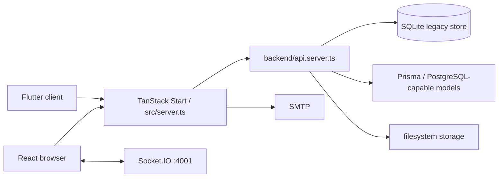
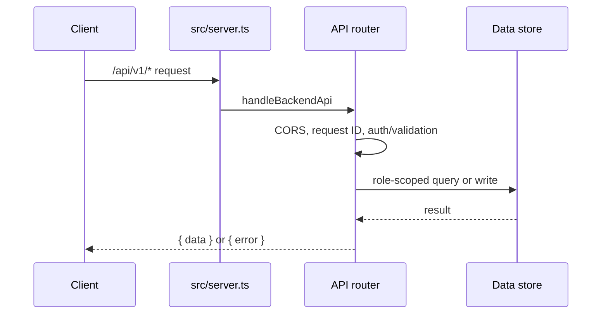
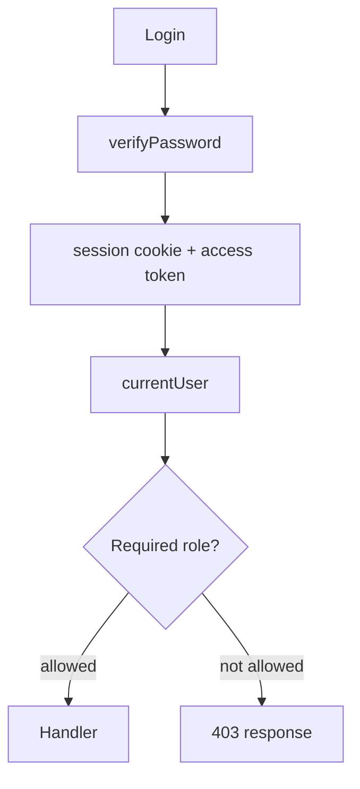

# Architecture

The browser app is rendered by TanStack Start. `src/server.ts` handles health and `/api/v1` requests first, then passes other paths to the TanStack server entry. The standalone Node wrapper is `server/http-server.mjs`; realtime traffic is a separate Socket.IO process in `server/socket-server.mjs`.

## Layers and patterns

- Route/UI layer: file routes under `src/routes`; feature screens under `src/client`, `src/professional`, and `src/admin`.
- API layer: a hand-written path/method router in `src/backend/api.server.ts`; validation uses Zod.
- Data layer: legacy `*.server.ts` repositories use SQLite; `src/lib/prisma.ts` creates a Prisma client for PostgreSQL/SQLite adapter selection.
- Shared application concerns: `auth-session.server.ts`, `password.server.ts`, `email.server.ts`, `notification-*.server.ts`, and file helpers in `api.server.ts`.

Authentication accepts a signed session cookie or bearer token; user activity is checked against the local user record. Google OAuth uses an anti-CSRF state cookie. Socket.IO accepts client-supplied user IDs/events and is not visibly tied to the HTTP session—see the security finding in [Security](AUTHENTICATION_AND_SECURITY.md).

No job queue, cron scheduler, distributed cache, metrics backend, or tracing provider was found. Files are stored under `FILE_STORAGE_PATH`/`storage`; reporting generates files there. JSON request errors use `src/backend/http.server.ts`.
