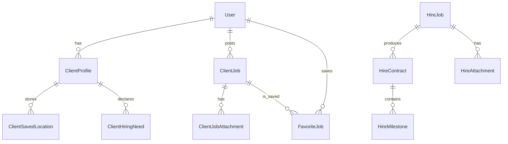

# Database

## Confirmed data technologies

`prisma/schema.prisma` defines a PostgreSQL datasource and models for users, profiles, client jobs/attachments/favorites, CMS, categories, direct hires/milestones, transactions, negotiations and reviews. Conversely, `src/lib/user-db.server.ts`, `job-db.server.ts`, `project-request-db.server.ts`, and API helpers use `better-sqlite3` and create/query additional legacy tables such as `Service`, `ProjectRequest`, `Wallet`, `Notification`, `StoredFile`, and Socket tables. This is an active hybrid/migration state, not a single authoritative schema.

## Prisma model notes

- `User`: autoincrement integer key; unique email, phone and optional Google ID; role and profile fields. `ClientProfile` is separately related, while some profile fields remain directly on `User`.
- `ClientJob`: belongs to `User`, indexed by `userId`/`status`; supports budget, urgency, mode, location and attachments.
- `FavoriteJob`: user/job unique pair; cascades on delete.
- CMS (`CmsPage`, `CmsPageVersion`, `CmsMedia`, `WebsitePage`, `LegalPage`) uses unique slugs/page paths and status enum.
- Direct hires use string IDs: `HireJob` → `HireContract` → `HireMilestone`; `HireAttachment` belongs to job.
- `ProjectTransaction`, `ProjectNegotiation`, `ProjectReview` keep their own integer tracking/client/professional IDs and indexes, without Prisma relation definitions.

## Migrations and operations

The only checked-in Prisma migration is `prisma/migrations/0_init/migration.sql`; compare it to the schema before relying on it. Commands are `npm run prisma:generate`, `npm run prisma:migrate` (development), `npm run prisma:deploy` (production), `npm run prisma:push`, and `npm run prisma:studio`. No repository-supported rollback, seed command, reset command, backup command, or transactional migration playbook was found—**Needs confirmation**.

Back up the database and `FILE_STORAGE_PATH` together. Existing scripts (`scripts/inspect-*.mjs`, `migrate-sqlite-to-supabase.mjs`, `migrate-local-users-to-postgres.mjs`, `migrate-local-client-jobs.mjs`) are migration/inspection aids; review their source and use a copy of data first.
